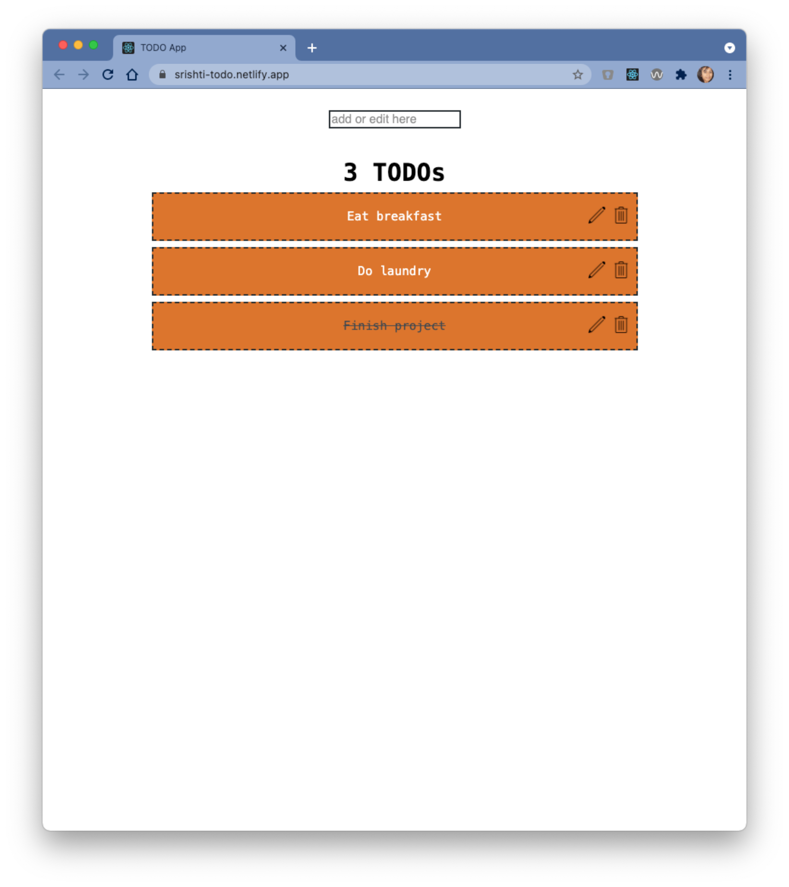

# TODO App

## Table of Contents

1. [Overview](#overview)
2. [Install & Run](#install-&-run)
3. [Bootstrapping](#bootstrapping)
4. [Backend Code](#backend-code)
5. [Credits](#credits)

## Overview

This project is a TODO application which lets a user **view** all saved TODOs (or tasks), **mark** a TODO as complete or incomplete, **create** a new TODO, **update** an existing TODO, and **delete** a saved TODO.

[**Live Demo**](https://srishti-todo.netlify.app/)



This project has been created using `React.js`.

## Install & Run

Follow the steps mentioned below to install and run this application in development mode:

1. **Clone** the [Git repository](https://github.com/srishti/todo).
2. In your Terminal, go to the path inside the repository.

   ```zsh
   cd todo
   ```

3. Run the following command inside your Terminal to **install all `Node.js` dependencies**:

   ```zsh
   npm i
   ```

4. Run the following command inside your Terminal to **run the application on a development server**:
   ```zsh
   npm start
   ```
   You can see that a new window or tab has been opened for you in your default browser. Alternatively, you can **open the URL [http://localhost:3000/](http://localhost:3000/)** in your browser.

## Bootstrapping

This project was bootstrapped with [Create React App](https://github.com/facebook/create-react-app).

## Backend Code

The backend code is available at **GitHub** inside the repository named **[hooks-api](https://github.com/srishti/hooks-api)**. To run the backend code, you must follow the steps mentioned in its `README.md` file.

## Credits

This project is an inspiration from the course named [React Hooks](https://aurigo.udemy.com/course/react-hooks/) by **Reed Barger** on **Udemy**.  
Thank you, Reed!
